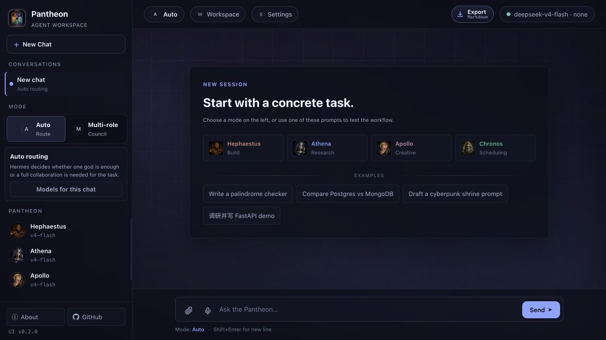
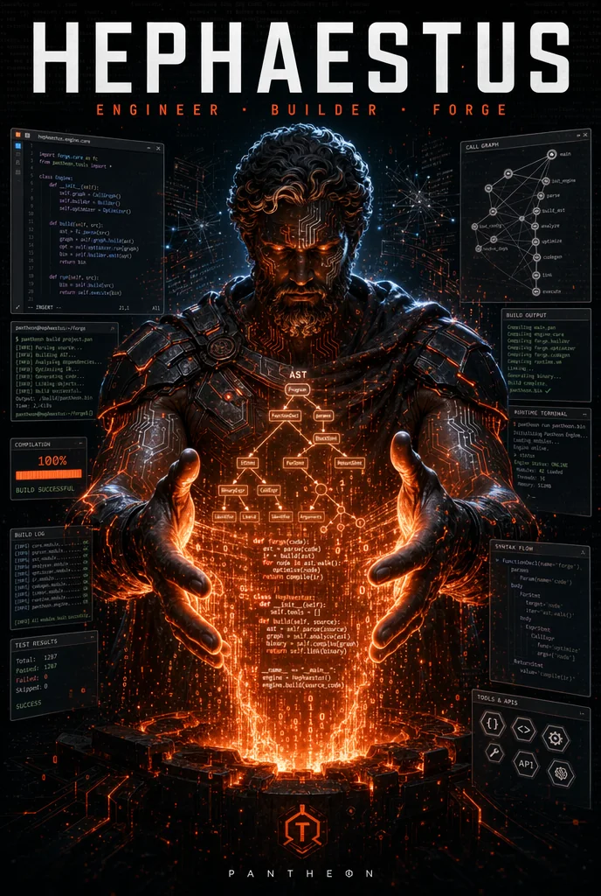

<p align="center">
  
</p>

<p align="center">
  
</p>

<h1 align="center">Pantheon</h1>

<p align="center">
  <strong>A local multi-agent workspace</strong><br>
  Hermes plans and orchestrates while specialist gods execute.
</p>

<div align="center">

[](CHANGELOG.md)
[](https://www.python.org)
[](https://github.com/RyosukeSAMA/github-ai/actions)
[](LICENSE)
[](#current-boundaries)

**English** | [简体中文](README.zh-CN.md)

[Quick Start](#quick-start) | [Agent Roles](#agent-roles) | [Integrations](#integrations) | [Architecture](#architecture) | [Documentation](#documentation)

</div>



<p align="center"><sub>Pantheon brings chat, agent orchestration, workspace activity, files, terminal access, and webpage preview into one local interface.</sub></p>

Pantheon turns a request into an observable, controllable local workflow. Use **Auto** to let Hermes select the right specialist, switch to **Multi-role** for an explicit collaboration plan, or talk directly to one god. The same runtime is available through the Web UI, CLI, and Python SDK.

## What Works Today

| Area | Current implementation |
|---|---|
| Multi-agent orchestration | Auto routing, direct roles, and structured Multi-role plans with handoffs and review contracts |
| Agent workspace | Live Activity, sandboxed HTML Preview, file browsing/editing, and Terminal |
| Conversations | Multiple chats, first-message titles, Markdown export, attachments, and slash commands |
| Memory | Local SQLite storage, per-role scope, natural-language detection, and save suggestions |
| Chronos | Persistent one-time and recurring jobs with run history |
| Extensions | 6 built-in Skills, local Skills, plugin prompt packs, MCP tools, and Webhook input |
| Local setup | Provider/model wizard, configuration checks, API tests, login lock, and optional auto-start service |

Pantheon is local-first. Configuration, memory, scheduled jobs, and extension state stay in the selected workspace. Conversations and display preferences stay in the current browser. Task content is sent only to model providers and external integrations that you enable.

<a id="quick-start"></a>

## Quick Start

### Requirements

- Python 3.10 or newer
- Git
- At least one supported model provider, or a running Ollama instance
- macOS or Linux recommended; Windows users should currently use WSL

### Install and Launch

```bash
git clone https://github.com/RyosukeSAMA/github-ai.git
cd github-ai

python3 -m venv .venv
source .venv/bin/activate
python -m pip install --upgrade pip
python -m pip install -e .

pantheon web
```

To keep Pantheon available after restarting the computer, install the optional
per-user service from the repository root:

```bash
pantheon service install
pantheon service status
```

It starts after user login and remains bound to `127.0.0.1:8000`. Use
`pantheon service logs` or `pantheon service restart` for maintenance. On macOS,
service logs are stored in `~/Library/Logs/Pantheon/`.

Open <http://127.0.0.1:8000/> and go to **Settings -> Setup**:

1. Select DeepSeek, OpenAI, Anthropic, or Ollama.
2. Choose a model and enter an API key when required.
3. Run **Check setup**, then **Test API**.
4. Select **Save local config**.

The Web UI saves API keys to the local `.env` file and writes provider, base URL, and model choices to `config/pantheon.yaml`. Restart `pantheon web` when a backend configuration change needs a complete runtime reload.

The Anthropic catalog includes Claude Opus 5 (`claude-opus-5`). Compatible Claude
gateways can use the same **Anthropic** provider with their own Base URL.

<details>
<summary>Configure files manually</summary>

```bash
cp config/pantheon.example.yaml config/pantheon.yaml
cp .env.example .env
```

Add the required keys to `.env`, then set matching providers, models, and base URLs in `config/pantheon.yaml`. Do not commit either local file.

</details>

### Your First Task

1. Select **New Chat** and keep **Auto** mode enabled.
2. Enter a concrete task, such as `Build a responsive personal site and return complete HTML`.
3. Open **Workspace** to follow the Hermes plan, active agent, and execution steps.
4. Use **Preview** for HTML, **Files** for saved artifacts, and **Terminal** for local commands.
5. Type `/` in the composer to access commands such as `/multi`, `/schedule`, `/memory`, `/skills`, and `/preview`.

<a id="agent-roles"></a>

## Agent Roles

Pantheon uses god identities to make responsibilities explicit: Hermes orchestrates, Hephaestus builds, Athena researches, Apollo creates, and Chronos schedules.

<p align="center">
  <a href="docs/images/posters/pantheon.webp">
    
  </a>
</p>

<p align="center"><sub>Pantheon concept artwork. The Web UI screenshot above shows the current product interface.</sub></p>

### Concept Posters

<p align="center">
  <a href="docs/images/posters/hermes.webp"></a>
  <a href="docs/images/posters/hephaestus.webp"></a>
  <a href="docs/images/posters/athena.webp"></a>
</p>

<p align="center">
  <a href="docs/images/posters/apollo.webp"></a>
  <a href="docs/images/posters/chronos.webp"></a>
</p>

<p align="center"><sub>Select a poster to open the full image. Artwork expresses each role's product identity; actual model, web, and media capabilities depend on the provider, Skills, and MCP tools configured by the user.</sub></p>

Hermes, Hephaestus, Athena, and Apollo can each use a different provider and model. Values in `config/pantheon.example.yaml` are illustrative rather than required defaults.

| God | Specialty | Model | Execution boundary |
|---|---|---|---|
| **Hermes** | Planning, routing, coordination, and final synthesis | Configured independently | Dispatches configured agents and approved extensions |
| **Hephaestus** | Code generation, debugging, refactoring, and review | Configured per role | File or terminal changes go through Workspace or approved MCP tools |
| **Athena** | Research, comparison, fact checking, and summarization | Configured per role | Live web access requires an approved MCP or provider tool |
| **Apollo** | Creative planning, writing, image prompts, and storyboards | Configured per role | Image, audio, or video generation requires an external tool |
| **Chronos** | One-time and recurring local jobs | No LLM required | Runs only while the Pantheon Web service is active |

A role prompt does not grant external capabilities by itself. Third-party tools must be connected, assigned to a god, and allowed by an MCP policy before Pantheon can execute them.

## Workspace

The right-side Workspace is the task operations view:

- **Activity** shows the current task, Hermes plan, typed steps, dependencies, Agent handoffs, deliverables, acceptance criteria, elapsed time, Skills, memory hits, MCP calls, approvals, and completion state.
- **Preview** renders complete HTML and message artifacts in a sandboxed iframe, with desktop/mobile modes and zoom controls.
- **Files** browses, opens, edits, saves, downloads, and previews files inside the workspace root.
- **Terminal** streams local command output, retains command history, supports cancellation, and asks for confirmation on recognized risky commands.

Generated code starts as a message artifact. It becomes a local file only when the user selects **Save to Files** or an approved tool performs a write. This prevents ordinary chat output from silently modifying the project.

## Memory and Scheduling

### Memory

Memory is stored in `.pantheon/memory.sqlite` and can be global or scoped to Hermes, Hephaestus, Athena, Apollo, or Chronos.

- Say "remember..." or use `/remember` to save something explicitly.
- Pantheon can suggest useful memories from ordinary conversation for one-click confirmation.
- Optional auto-capture stores short task/result summaries. It is disabled by default to limit noise.
- Use `/memories <query>` or **Settings -> Memory** to search, edit, pin, and delete entries.

### Chronos

Chronos converts supported natural-language time expressions into persistent jobs stored in `.pantheon/chronos_jobs.json`. Select Chronos or use `/schedule` to create, inspect, pause, resume, run now, or delete jobs.

Jobs survive a restart, but Chronos is a local scheduler. Nothing runs while the Pantheon Web service is stopped.

<a id="integrations"></a>

## Integrations

Integrations expose working local capabilities rather than decorative toggles.

| Module | Status | Current purpose |
|---|---|---|
| **Skills** | Available | Loads standard `SKILL.md` files with automatic matching, explicit `/skill` invocation, 6 built-in Skills, and editable local Skills |
| **MCP** | Available | Connects stdio or Streamable HTTP servers, discovers tools, assigns gods, and applies auto-run or per-call approval policies |
| **Plugins** | Available | Injects enabled local prompt packs into selected agent contexts; it does not execute arbitrary Python plugin code |
| **Channels** | Webhook available | Accepts token-protected tasks from scripts or services through `/api/channels/webhook` |

### Built-in Skills

- `plan-multi-agent-task`: Hermes turns a complex request into an ordered multi-god plan.
- `fix-and-verify`: Hephaestus finds, fixes, and verifies a concrete defect.
- `research-with-sources`: Athena separates evidence from inference and returns traceable sources.
- `build-web-preview`: Apollo and Hephaestus design and implement a previewable webpage.
- `review-code-change`: Athena and Hephaestus review concrete risks in a code change.
- `schedule-and-deliver`: Chronos converts timing requirements into a persistent local job.

### MCP Workflow

1. Open **Settings -> Integrations -> MCP** and add a server.
2. Select **Test connection** to discover tools.
3. Enable only the required tools and assign the gods allowed to use them.
4. Choose automatic execution or approval for every call.
5. Enable **Let agents use approved tools**, then describe the task in a normal conversation.

GitHub, Context7, and Figma Desktop are connection-form presets, not bundled accounts or hosted MCP services. Users still provide credentials and run or connect the corresponding local or remote server.

Channels currently expose only the Webhook input. Native adapters for DingTalk, WeCom, WeChat, QQ, Slack, Teams, and similar services are planned but not bundled.

## CLI and Python SDK

### CLI

```bash
# Let Hermes choose the route
pantheon ask "Research a topic and organize reliable evidence"

# Send a task directly to one god
pantheon ask --role hephaestus "Write a Python palindrome checker"

# Force an ordered multi-agent plan
pantheon ask --multi "Research an AI product, design a page, and generate HTML"

# Inspect and invoke a Skill explicitly
pantheon skills
pantheon ask --skill fix-and-verify "Fix the null-handling regression"
```

### Python SDK

```python
from pantheon import Pantheon

pantheon = Pantheon()

result = pantheon.ask("Design and build a responsive personal site", mode="multi")
print(result["content"])

for step in result["steps"]:
    print(step.role, step.duration_ms, step.success)
```

## Local Data and Security

| Location | Stored data |
|---|---|
| Browser `localStorage` | Conversation history, display preferences, and selected UI state |
| `.env` | API keys, Webhook token, and local login settings |
| `config/pantheon.yaml` | Providers, models, roles, Web settings, and logging |
| `.pantheon/memory.sqlite` | Long-term memories and memory suggestions |
| `.pantheon/chronos_jobs.json` | Chronos jobs and run state |
| `.pantheon/mcp_servers.json` | MCP servers and policy; secrets are stored only as environment-variable references |
| `.pantheon/plugins.json` | Local plugin prompt packs |
| `.pantheon/skills/` | Local standard Skills |

These repository-local state files are covered by `.gitignore` and should remain on the user's machine.

> [!IMPORTANT]
> Pantheon includes file-write and terminal-execution APIs and listens on `127.0.0.1` by default. Before binding to `0.0.0.0`, a LAN address, NAS, remote server, or reverse proxy, enable the login lock in **Settings -> Security** and add firewall or proxy access controls. The current login lock protects a single local operator; it is not a public multi-user authentication system.

<a id="current-boundaries"></a>

## Current Boundaries

Pantheon v0.2.1 is still an alpha local workspace. Understand these limits before deployment:

- Chat agents execute synchronously. Multi-role steps run in plan order, not in parallel.
- Agent communication is structured and mediated by Hermes. Pantheon does not run
  unbounded peer-to-peer conversations or autonomous feedback loops.
- Question, review, and revision messages currently come from the planned workflow;
  runtime results do not yet trigger automatic replanning.
- Attachments are converted to text context when supported; this is not universal multimodal file input.
- Voice input depends on browser SpeechRecognition support, which varies by browser and language.
- HTML Preview is sandboxed, but generated pages should still be treated as untrusted content.
- Plugin packs are prompt-based extensions, not arbitrary executable plugins or a plugin marketplace.
- The Security login lock is single-user local protection, not production identity management.

<a id="architecture"></a>

## Architecture

```text
                    CLI | Web UI | Python SDK
                              |
                     Pantheon entry point
                              |
                Hermes routing and orchestration
              +---------------+----------------+
              |               |                |
       Skills / Memory   Plugin context   Approved MCP tools
              |               |                |
              +---------------+----------------+
                              |
       Hephaestus | Athena | Apollo | Chronos
                              |
                   Configured LLM providers

Web runtime: SSE Activity | Workspace | Preview | Files | Terminal
Local state: .env | pantheon.yaml | .pantheon/ | browser session
```

The runtime handles routing, role execution, Memory/Skill context injection, MCP approval and invocation, result synthesis, and SSE progress events. See [docs/architecture.md](docs/architecture.md) for the detailed flow.

## Project Layout

```text
pantheon/
|-- cli.py                 # Typer CLI
|-- core/
|   |-- pantheon.py        # Shared CLI / Web / SDK entry point
|   |-- hermes.py          # Orchestration and streaming events
|   |-- router.py          # Auto and Multi-role planning
|   |-- extensions.py      # Skills, Plugins, and MCP
|   |-- memory.py          # SQLite Memory
|   `-- scheduler.py       # Persistent Chronos jobs
|-- llm/                   # OpenAI-compatible, Anthropic, and Ollama clients
|-- roles/                 # Hermes, Hephaestus, Athena, Apollo, and Chronos
|-- skills/                # 6 bundled standard Skills
`-- web/
    |-- app.py             # FastAPI, SSE, Setup, Auth, and local APIs
    `-- static/            # Web UI and god avatars
```

## Testing

Regular use does not require development dependencies. Contributors can run:

```bash
python -m pip install -e ".[dev]"
ruff check .
pytest
```

Browser regression tests use a separate optional dependency and do not call a model:

```bash
python -m pip install -e ".[e2e]"
playwright install chromium
pytest e2e --browser chromium
```

Live provider diagnostics are opt-in because they make a real request and may
incur a small charge:

```bash
pantheon provider-test --role hermes --live
PANTHEON_LIVE_TEST=1 pytest tests/live -m live
```

The GitHub Actions matrix covers Python 3.10, 3.11, and 3.12, with a separate
Chromium E2E job. CI never receives or tests real provider credentials.

<a id="documentation"></a>

## Documentation

| Document | Contents |
|---|---|
| [Setup guide](docs/setup.md) | Provider configuration and troubleshooting |
| [Web UI guide](docs/web-ui.md) | Workspace, Memory, Integrations, testing, and shortcuts |
| [Architecture](docs/architecture.md) | Routing, execution flow, and component design |
| [Role guides](docs/roles/) | Prompts and responsibilities for every god |
| [FAQ](docs/faq.md) | Common configuration and behavior questions |
| [Changelog](CHANGELOG.md) | Version history |
| [Contributing](CONTRIBUTING.md) | Development and contribution workflow |
| [Security policy](SECURITY.md) | Supported versions and vulnerability reporting |

## Roadmap

- [x] **v0.1**: 5 roles, Hermes orchestration, CLI, Web UI, and SDK
- [x] **v0.2**: Multi-conversation workspace, live Activity, Chronos, Memory, Skills, MCP, Webhook input, and local login lock
- [x] **v0.2.1**: Auto-start service, Playwright regression tests, provider smoke tests, and FastAPI lifespan migration
- [ ] **v0.3**: Native channel adapters, MCP resources/prompts, and visual task orchestration
- [ ] **v0.4**: Installable extension catalog, semantic memory retrieval, and observability
- [ ] **v1.0**: Multi-user identity, audit logs, rate limiting, and distributed execution

## Contributing

Contributions to roles, Skills, Integrations, tests, documentation, and accessibility are welcome. See [CONTRIBUTING.md](CONTRIBUTING.md).

## License

MIT (c) 2024-2026 RyosukeSAMA
